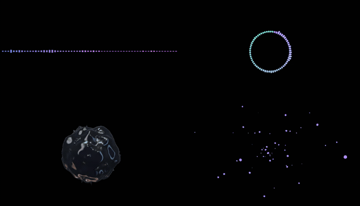

# Banger Elements

Audio-reactive elements for [Remotion](https://remotion.dev), from the makers of [banger.show](https://banger.show).

Preview each element, adjust its settings, and use the source in your project — no runtime component library required.



## Explore the collection

- [**Visualizers**](https://banger-elements.dev/visualizers) — waveforms, spectra, and audio-reactive forms.
- [**Shaders**](https://banger-elements.dev/shaders) — procedural backgrounds, immersive worlds, and evolving textures.
- [**Effects**](https://banger-elements.dev/effects) — wrappers that transform child content with treatments such as lens distortion and analog texture.

## Getting started

1. Browse the [showcase](https://banger-elements.dev) and preview an element.
2. Choose **Install in Studio** and confirm in Remotion Studio, or download the TSX source.
3. Connect audio for a visualizer or shader, or wrap existing content with an effect, then adjust its settings in your composition.

See the [setup and usage guide](apps/site/src/content/docs/getting-started.mdx) for details.

## Run locally

Requires Node.js 24.18.1 and Bun 1.3.8.

```bash
bun install
bun run dev
```

This starts the showcase at [localhost:3300](http://localhost:3300) alongside Remotion Studio.

## Development

- `packages/elements` — element source and collection build
- `apps/site` — showcase and docs
- `apps/studio` — Remotion compositions

Run `bun run check` to check formatting, lint, types, and tests.

## License

[MIT](LICENSE) © 2026 Noice Tech. Remotion and other dependencies have their own licenses.
